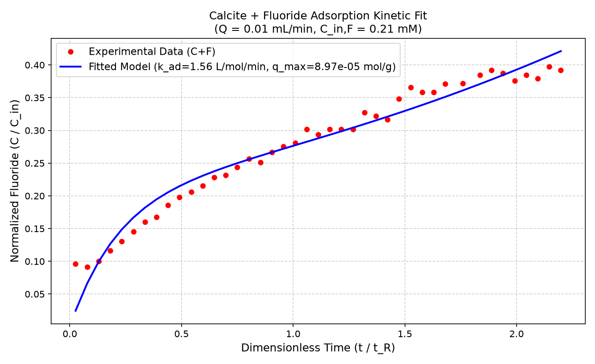

# Fluorapatite Mass Balance & Adsorption Kinetics

This repository runs the mass balance kinetic model for fluoride adsorption onto calcite in a continuous flow-stirred tank reactor (CFSTR).

## Model Fit Result

## Optimized Kinetic Parameters

| Parameter | Fitted Value | Unit |
| :--- | :--- | :--- |
| **Adsorption Rate Constant ($k_{\text{F, ad}}$)** | **1.564** | $\text{L} \cdot \text{mol}^{-1} \cdot \text{min}^{-1}$ |
| **Max Capacity ($q_{\text{max, F}}$)** | **8.969e-05** | $\text{mol} \cdot \text{g}^{-1}$ |
| **$\log_{10}(k_{\text{F, ad}})$** | **0.1943** | — |
| **$\log_{10}(q_{\text{max, F}})$** | **-4.0472** | — |

## Summary Data Table (First 10 Data Points)

| Time (min) | $t/t_R$ | $F_{\text{obs}}$ (mM) | $F_{\text{pred}}$ (mM) | $C/C_{\text{in, obs}}$ | $C/C_{\text{in, pred}}$ |
| :---: | :---: | :---: | :---: | :---: | :---: |
| 150 | 0.0259 | 0.020 | 0.005 | 0.0962 | 0.0245 |
| 450 | 0.0776 | 0.019 | 0.014 | 0.0914 | 0.0661 |
| 750 | 0.1293 | 0.021 | 0.021 | 0.1005 | 0.0996 |
| 1050 | 0.1810 | 0.024 | 0.027 | 0.1162 | 0.1267 |
| 1350 | 0.2328 | 0.027 | 0.031 | 0.1305 | 0.1487 |
| 1650 | 0.2845 | 0.030 | 0.035 | 0.1452 | 0.1669 |
| 1950 | 0.3362 | 0.034 | 0.038 | 0.1605 | 0.1819 |
| 2250 | 0.3879 | 0.035 | 0.041 | 0.1676 | 0.1946 |
| 2550 | 0.4397 | 0.039 | 0.043 | 0.1857 | 0.2055 |
| 2850 | 0.4914 | 0.042 | 0.045 | 0.1976 | 0.2149 |

*Full dataset exported to `cfstr_fitted_adsorption_results.csv`.*