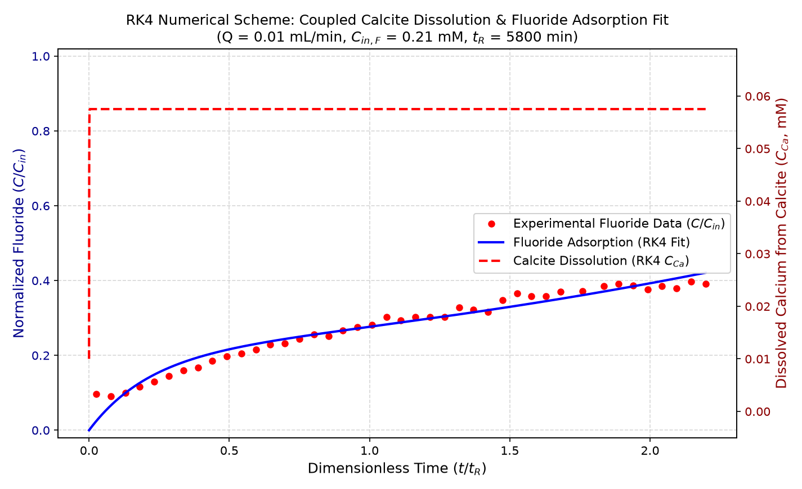

# Fluorapatite Mass Balance & Adsorption Kinetics

This repository runs the coupled mass balance kinetic model using a **4th-Order Runge-Kutta (RK4)** numerical integration scheme.

## RK4 Model Fit with Experimental Points & Calcite Dissolution

## Numerical Scheme & Model Parameters

| Property | Value | Description |
| :--- | :--- | :--- |
| **Numerical Integration Scheme** | **4th-Order Runge-Kutta (RK4)** | $\mathcal{O}(\Delta t^4)$ local truncation error accuracy |
| **Adsorption Rate Constant ($k_{\text{F, ad}}$)** | **1.565 $\text{L} \cdot \text{mol}^{-1} \cdot \text{min}^{-1}$** | Fitted second-order adsorption rate constant |
| **Max Capacity ($q_{\text{max, F}}$)** | **8.968e-05 $\text{mol} \cdot \text{g}^{-1}$** | Maximum surface site concentration |
| **Calcite Dissolution Rate ($k_{\text{calcite}}$)** | **$10^{-5.90} \text{mol} \cdot \text{m}^{-2} \cdot \text{min}^{-1}$** | Surface normalized dissolution rate constant |
| **Hydraulic Residence Time ($t_R$)** | **5800 minutes** | $V / Q$ (~96.7 hours) |

## Summary Data Table (First 10 Points)

| Time (min) | $t/t_R$ | $F_{\text{obs}}$ (mM) | $F_{\text{pred, RK4}}$ (mM) | $C/C_{\text{in, obs}}$ | $C/C_{\text{in, pred}}$ | $C_{\text{Ca, RK4}}$ (mM) |
| :---: | :---: | :---: | :---: | :---: | :---: | :---: |
| 150 | 0.0259 | 0.020 | 0.005 | 0.0962 | 0.0245 | 0.0575 |
| 450 | 0.0776 | 0.019 | 0.014 | 0.0914 | 0.0661 | 0.0575 |
| 750 | 0.1293 | 0.021 | 0.021 | 0.1005 | 0.0996 | 0.0575 |
| 1050 | 0.1810 | 0.024 | 0.027 | 0.1162 | 0.1267 | 0.0575 |
| 1350 | 0.2328 | 0.027 | 0.031 | 0.1305 | 0.1487 | 0.0575 |
| 1650 | 0.2845 | 0.030 | 0.035 | 0.1452 | 0.1668 | 0.0575 |
| 1950 | 0.3362 | 0.034 | 0.038 | 0.1605 | 0.1819 | 0.0575 |
| 2250 | 0.3879 | 0.035 | 0.041 | 0.1676 | 0.1946 | 0.0575 |
| 2550 | 0.4397 | 0.039 | 0.043 | 0.1857 | 0.2054 | 0.0575 |
| 2850 | 0.4914 | 0.042 | 0.045 | 0.1976 | 0.2149 | 0.0575 |
