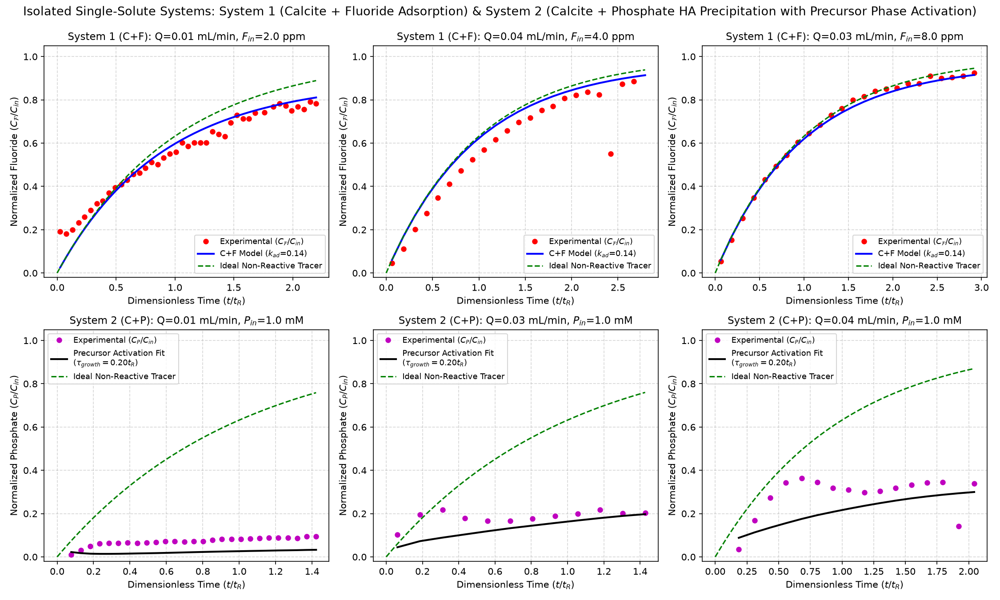

# Fluorapatite Mass Balance: System 1 (C+F) vs. System 2 (C+P)

This repository models isolated single-solute continuous flow-stirred tank reactor (CFSTR) dynamics:
1. **System 1 (Calcite + Fluoride):** Decoupled fluoride adsorption and calcite dissolution.
2. **System 2 (Calcite + Phosphate):** Decoupled continuous Hydroxyapatite (HA) surface precipitation with smooth Precursor Phase Transformation kinetics ($	au_{	ext{growth}}$).

## Two Systems Model Comparison

## Fitted Kinetic Parameters

| System | Process / Mechanism | Parameter | Fitted Value | Unit |
| :--- | :--- | :---: | :---: | :--- |
| **System 1 (C+F)** | Fluoride Adsorption Rate | $k_{\text{F, ad}}$ | **0.1370** | $\text{L} \cdot \text{mol}^{-1} \cdot \text{min}^{-1}$ |
| **System 1 (C+F)** | Fluoride Surface Capacity | $q_{\text{max, F}}$ | **4.3813e-05** | $\text{mol} \cdot \text{g}^{-1}$ |
| **System 2 (C+P)** | HA Surface Precipitation Rate | $k_{\text{HA}}$ | **3.1624e-11** | $\text{mol} \cdot \text{m}^{-2} \cdot \text{min}^{-1}$ |
| **System 2 (C+P)** | HA Critical Supersaturation | $\Omega^*_{\text{HA}}$ | **1.0500** | — |
| **System 2 (C+P)** | Precursor Phase Transformation Tau | $\tau_{\text{growth}}$ | **19.95% $t_R$** | — |
